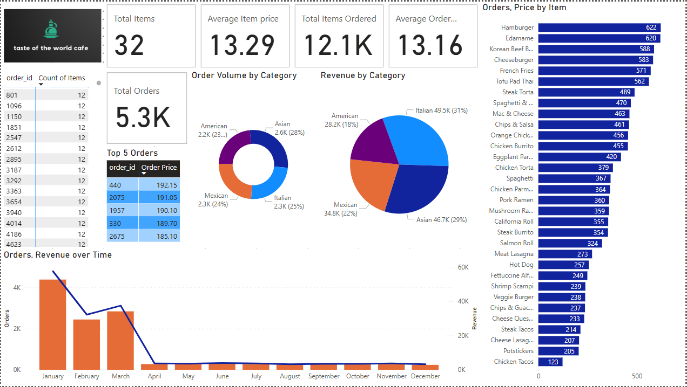

# 🍽️ Restaurant Orders Analysis - SQL & Power BI Project

Hi! I'm Gouri Parvathi, and this is my analysis project for **Taste of the World Café**. The goal was to assess how customers responded to a newly launched menu and to better understand ordering patterns using SQL and Power BI.

---

## 🎯 Project Objectives

### 1️⃣ Explore the Menu
- Count how many items are available.
- Identify the least and most expensive dishes.
- Focus on Italian items — quantity and price range.
- Analyze each category by number of items and average price.

### 2️⃣ Analyze Orders
- Review the range of order dates.
- Find out how many orders and items were placed.
- Identify the largest orders based on number of items.
- Check how many orders had more than 12 items.

### 3️⃣ Understand Customer Behavior
- Combine order and menu data.
- Discover the most and least ordered dishes, and their categories.
- Highlight the top 5 highest-spending orders.
- Explore what made those high-spend orders unique.

---

## 🧠 Insights And Recommendations
### Key Findings:

- **Most Expensive Item:** Shrimp Scampi *(Italian)*
- **Least Expensive Item:** Edamame *(Asian)*
- **Top Selling Item:** Hamburger *(American)* — *622 orders (5.14%)*
- **Least Selling Item:** Chicken Tacos *(Mexican)* — *123 orders (1.02%)*
- **Best Performing Category (Revenue):** Italian (31% of total revenue)
- **Least Performing Category (Revenue):** American (18% of total revenue)
- **Order Timing:**
  - January: 36.12% of orders
  - February: 20.22%
  - March: 23.49%
  - Only ~2.2% of orders in each later month
- **Average Order Value:** $13.16
- **Average Item Price:** $13.29
- **Most Popular Category (by volume):** Asian (28% of orders)
- **Total Orders:** 5.3K
- **Total Items Ordered:** 12.1K

---

### 📈 Business Recommendations:

- Focus marketing around **Italian dishes** — they generate the highest revenue.
- Investigate why **American cuisine** has lower revenue despite high item popularity (Hamburger).
- Promote **Chicken Tacos** through discounts or bundled meals to boost its sales.
- Launch **off-season promotions** during months after March to boost low order volume.
- Expand **Asian cuisine** offerings to capitalize on its strong customer demand.
- Implement **upselling strategies** to increase the average order value beyond $13.16.

---

## 🗃️ Table Structure

### `menu_items` Table  
| Field         | Description                                      |
|---------------|--------------------------------------------------|
| menu_item_id  | Unique ID of a menu item                         |
| item_name     | Name of the menu item                            |
| category      | Cuisine or type of dish                          |
| price         | Price of the item in US Dollars ($)              |

### `order_details` Table  
| Field             | Description                                      |
|------------------|--------------------------------------------------|
| order_details_id | Unique ID of an item within an order             |
| order_id         | Order reference ID                               |
| order_date       | Date of the order (MM/DD/YY)                     |
| order_time       | Time the order was placed (HH:MM:SS AM/PM)       |
| item_id          | Foreign key matching `menu_item_id` from `menu_items` |

---

## 📁 File Structure
📦 Restaurant-Orders/
 ┣ 📜 restaurant_orders_analysis.sql
 ┣ 📜 README.md
 ┣ 📂 data/
 ┃ ┗ 📄 menu_items.csv
 ┃ ┗ 📄 order_details.csv
 ┣ 📂 dashboards/
 ┃ ┗ 📄 restaurant_orders.pbix
 ┃ ┗ 📄 dashboard_screenshot1.png
 ┃ ┗ 📄 dashboard_screenshot2.png

---

## 📊 Power BI Dashboard

I've also created an interactive dashboard to visualize insights like top dishes, sales trends, and high-value orders.

➡️ [Download the Power BI Dashboard (.pbix)](Dashboards/Restaurant_Orders_Analysis_Dashboard.pbix)

### Sneak Peek:

---

## 🛠️ Tools I Used

- **Excel**: For data cleaning and formatting
- **SQL**: PostgreSQL for querying and data analysis
- **Power BI**: For data visualization
- **Git & GitHub**: For version control and sharing my work

---
